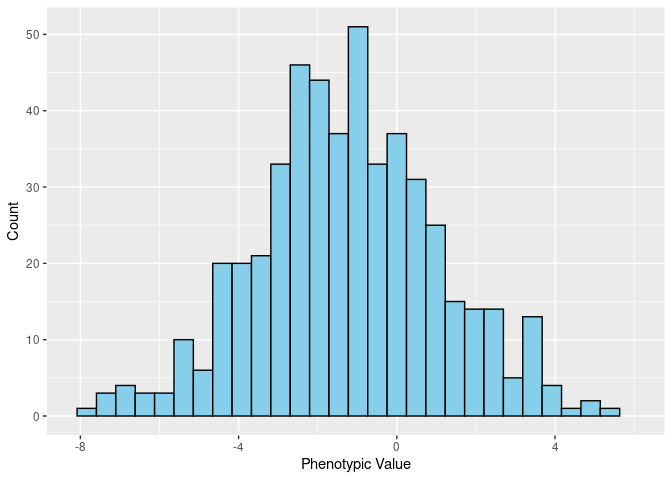
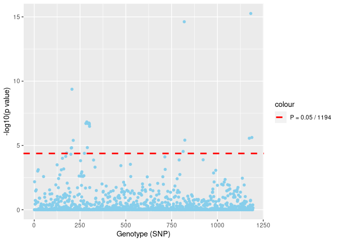
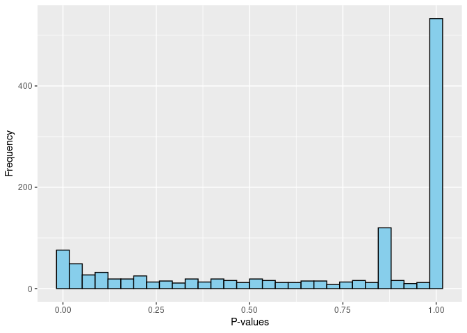
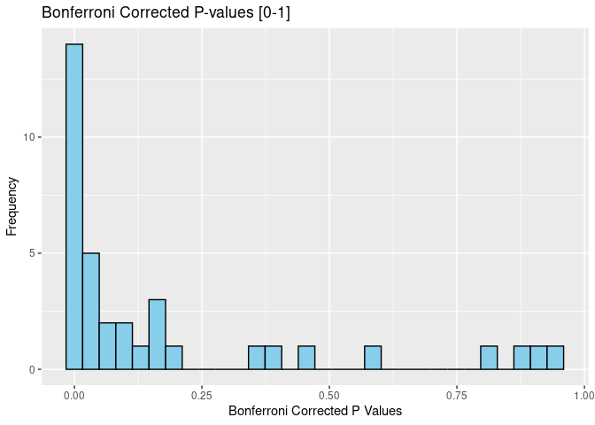
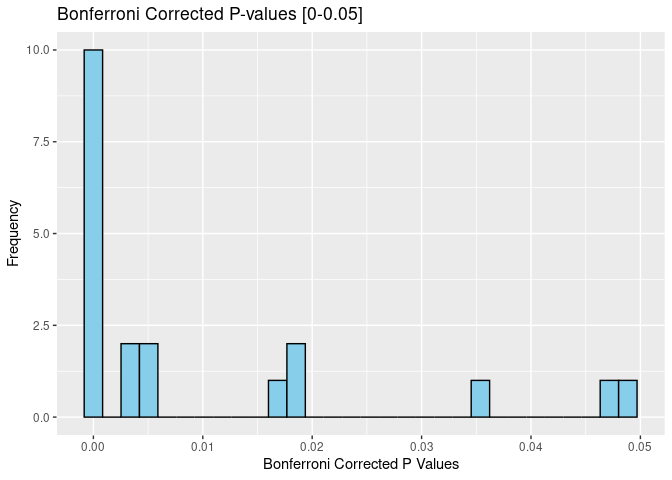

## **Problem 1**

### **1a.) Causal Polymorphisms**

**Provide a symbolic formula that defines a causal polymorphism AND provide a definition of a causual polymorphism.**

**Definition: ** A **causal polymorphism** is a position in the genome where an experimental manipulation of the DNA produces an effect on the phenotype on average or under specified conditions.

**Symbolic Formula: ** $A_1 \rightarrow A_2 \Rightarrow \Delta Y | Z$

**Explanation: ** $A_1 \rightarrow A_2$: Mutation from Allele_1 to Allele_2, 
$\Delta Y$: Observed change in phenotype, $| Z$: Conditioned on the specifiable conditions where this relationship holds true.

### **1b.) The Genetic Regression Model**

**For the genetic regression model:**

$$
Y = \beta_{\mu} + X_a \beta_a + X_d \beta_d + \epsilon
$$

$$
\epsilon \sim N(0, \sigma^{2}_epsilon)
$$

**what is the $E(Y | X_a = x_a, X_d = x_d)$ (i.e. the expected value of the phenotype for an individual with a specific genotype: $x_a, x_d$?**

$$
E(Y | X_a = x_a, X_d = x_d) \\
= E(B_\mu) + E(X_a \beta_a) + E(X_d \beta_d) + E(\epsilon) \\
= \beta_\mu + E(X_a \beta_a) + E(X_d \beta_d) + 0 \\
= \beta_\mu + E(X_a \beta_a) + E(X_d \beta_d) \\
= \beta_\mu + \beta_a E(X_a) + \beta_d E(X_d) \\
= \beta_\mu + \beta_a x_a + \beta_d x_d \\
$$

## **Problem 2**

Consider the data in the files (`QG21 - hw5\_phenotypes.txt`; `QG21 - hw5\_genotypes.txt`) of the scaled height phenotypes and SNP genotype data (respectively) collected in a GWAS. Note that in the `phenotypes` file the column lists the individuals in order (1st entry is the phenotype for individual 1, the nth is for individual $n$). Also note that for each of the SNPs, there are two total alleles, i.e. two letters indicate each SNP and there are three possible states per SNP genotype: two homozygotes and a heterozygote. In the `genotypes` file, each column represents a specific SNP (column 1 = genotype 1, column 2 = genotype 2) and each consecutive pair of rows represent all of the genotype states for an individual for the entire set of SNPs (rows 1 and 2 = all of individual 1's genotypes, rows 3 and 4 = individual 2's genotypes). Also note that the genotypes in the file are listed in order along the genome such that the first genotype is `genotype 1` and the last is `genotype N`.

**Libraries used**


```r
library(dplyr)
library(ggplot2)
library(magrittr)
library(patchwork)
```
 
### **2a.) Loading Phenotype Data**


```r
sim_pheno_df <- read.csv("../QG21 - hw5_phenotypes.txt", 
                         header = FALSE, col.names = 'phenotype') %>% 
  as.data.frame()
 
cat(nrow(sim_pheno_df), 'sample phenotypes loaded')
```

```
500 sample phenotypes loaded
```

### **2b.) Phenotype Histogram**


```r
min_x <- min(sim_pheno_df)
max_x <- max(sim_pheno_df)

ggplot(sim_pheno_df, aes(phenotype)) + 
  geom_histogram(color = 'black', 
                 fill = 'skyblue') + 
  xlim(c(min_x, max_x)) +
  ylab("Count") + xlab('Phenotypic Value')
```

<!-- -->

### **2c.) Loading Genotype Data**


```r
geno_import <-
  read.table("../QG21 - hw5_genotypes.txt", 
              header = FALSE, 
              stringsAsFactors = FALSE,
              colClasses = "character") %>% 
  t()

print_geno_import <- 
  geno_import %>% 
  as.data.frame() %>% 
  set_rownames(paste0('SNP_', seq_len(nrow(.)))) %>% 
  set_colnames(paste0('Sample_', 
                      paste0((seq_len(ncol(.))+1) %/% 2), c('_allele_1', '_allele_2')))

print_geno_import %>% 
  .[1:10, 1:5]
```

```
       Sample_1_allele_1 Sample_1_allele_2 Sample_2_allele_1 Sample_2_allele_2
SNP_1                  a                 a                 t                 t
SNP_2                  c                 c                 g                 c
SNP_3                  g                 g                 g                 g
SNP_4                  t                 t                 t                 t
SNP_5                  g                 g                 g                 g
SNP_6                  c                 c                 c                 c
SNP_7                  g                 t                 g                 g
SNP_8                  c                 c                 g                 g
SNP_9                  g                 g                 g                 g
SNP_10                 c                 c                 c                 c
       Sample_3_allele_1
SNP_1                  t
SNP_2                  c
SNP_3                  a
SNP_4                  t
SNP_5                  g
SNP_6                  c
SNP_7                  g
SNP_8                  g
SNP_9                  g
SNP_10                 c
```

```r
cat(ncol(geno_import), 'sample genotypes loaded (2 per individual)')
```

```
1000 sample genotypes loaded (2 per individual)
```

### **2d.) Forming** $X_a$ and $X_d$ from Genotype Data

We will use the `genotype_coder()` function provided by Steven Kulm in Lab 7 of this course.


```r
# Stacks together the columns of the present SNP into one list
concat_geno_input <- matrix(NA, 
                            nrow = nrow(geno_import) * 2, 
                            ncol = ncol(geno_import) / 2)
                            

for (col in seq(1, ncol(geno_import), by = 2)) {
  assign_col <- ((col-1)/2)+1
  concat_geno_input[, assign_col] <- c(geno_import[, col], geno_import[, col+1])
}

xa_converter <- function(geno_col, numSamples) {
  geno_count <- table(geno_col)
  minor_allele <- names(geno_count[geno_count == min(geno_count)])
  xa <- (geno_col[1:numSamples] == minor_allele) +
        (geno_col[(numSamples+1):length(geno_col)] == minor_allele)
  xa <- xa-1
  return(xa)
}

xa_mat  <- apply(concat_geno_input, 2, 
                    xa_converter, 
                    nrow(geno_import))

xa_mat <- t(xa_mat)

xd_mat <- 1 - 2*abs(xa_mat)
```


```r
xa_mat[1:5,1:5]
```

```
     [,1] [,2] [,3] [,4] [,5]
[1,]   -1    1   -1   -1   -1
[2,]   -1    0   -1   -1   -1
[3,]   -1    1   -1   -1   -1
[4,]   -1    1   -1   -1   -1
[5,]   -1    0   -1   -1    1
```

```r
xd_mat[1:5,1:5]
```

```
     [,1] [,2] [,3] [,4] [,5]
[1,]   -1   -1   -1   -1   -1
[2,]   -1    1   -1   -1   -1
[3,]   -1   -1   -1   -1   -1
[4,]   -1   -1   -1   -1   -1
[5,]   -1    1   -1   -1   -1
```

```r
xa_mat %>% dim()
```

```
[1]  500 1194
```

```r
xd_mat %>% dim()
```

```
[1]  500 1194
```

### **2e.) MLEs, F-Statistics and P-values**


```r
library(MASS)

n_genotypes <- ncol(xa_mat)

MLE_results <- vector('list', n_genotypes)
F_stat_results <- vector('numeric', n_genotypes)
P_value_results <- vector('numeric', n_genotypes)


for(genotype in seq_len(n_genotypes)) {
  xa_input <- xa_mat[,genotype]
  xd_input <- xd_mat[,genotype]
  pheno_input <- sim_pheno_df[,1] 
  n_samples <- length(xa_input)
  
  y <- matrix(pheno_input, ncol = 1)
  x <- cbind(rep(1,length(xa_input)), xa_input, xd_input)
  
  MLE_beta <- ginv(t(x) %*% x) %*% t(x) %*% y
  y_hat <- x %*% MLE_beta
  
  SSM <- sum((y_hat - mean(y))^2)
  SSE <- sum((y - y_hat)^2)
  
  df_M <- 2
  df_E <- n_samples - 3 
    
  MSM <- SSM / df_M
  MSE <- SSE / df_E
  
  Fstatistic <- MSM / MSE
  pval <- pf(Fstatistic, df_M, df_E, lower.tail = FALSE)
  
  MLE_results[genotype] <- MLE_beta
  F_stat_results[genotype] <- Fstatistic
  P_value_results[genotype] <- pval
}
```


### **2f.) Manhattan Plot**

**Manhattan Plot: ** genotypes in order on the x-axis and -log(p-values) on the y-axis


```r
df <- 
  data.frame(
    genotype = seq(1, n_genotypes), 
    pval = P_value_results) %>% 
  mutate(plot_pval = -log10(pval))


N_TESTS <- length(df$plot_pval)

df %>% 
  ggplot() + 
  geom_point(aes(x = genotype, y = plot_pval), 
             col = 'skyblue') +
  geom_hline(aes(yintercept = -log10(0.05 / N_TESTS),
             color = 'red_dotted_line'), lty = 2, lwd = 1.1) +
  xlab('Genotype (SNP)') + ylab('-log10(p value)') +
  scale_color_manual(values = c('red_dotted_line' = 'red'),
                     labels = c(paste0('P = 0.05 / ', N_TESTS)))
```

<!-- -->


### **2g.) P-value Histogram**


```r
P_value_results %>% 
  data.frame(p_values = .) %>% 
  ggplot() + 
    geom_histogram(aes(x = p_values), 
                   color = 'black', 
                   fill = 'skyblue') + 
    xlab('P-values') + ylab("Frequency")
```

<!-- -->

### **2h.) Expectation Under the Null Hypothesis**

If the null hypothesis (in part **2e.)**) was correct, we would expect the distribution of p-values to be **uniform**. However, the lower tail has accumulated much more of the overall density then we would see under our null hypothesis, as relationships between some of the genotypes and phenotype does exist, as seen by the F-statistic p-values falling below our $\alpha = 0.05$.

### **2i.) Multiple Testing Correction**


```r
pval_df <- 
  P_value_results %>% 
  data.frame(p_values = .) %>% 
  mutate(adj_p_values = 
           p.adjust(p_values, method = 'bonferroni')) 


pval_df %>% 
  filter(adj_p_values < 1) %>% 
  ggplot() + 
  geom_histogram(aes(adj_p_values), 
                 color = 'black', 
                 fill = 'skyblue') + 
  ggtitle("Bonferroni Corrected P-values [0-1]") + 
  xlab("Bonferroni Corrected P Values") + ylab("Frequency")
```

<!-- -->

```r
pval_df %>% 
  filter(adj_p_values < 0.05) %>% 
  ggplot() + 
  geom_histogram(aes(adj_p_values), 
                 color = 'black', 
                 fill = 'skyblue') +
  ggtitle("Bonferroni Corrected P-values [0-0.05]") + 
  xlab("Bonferroni Corrected P Values") + ylab("Frequency")
```

<!-- -->

```r
cat('Number of genotypes for which the H_0 is rejected: ', sum(pval_df$adj_p_values < 0.05))
```

```
Number of genotypes for which the H_0 is rejected:  20
```

### **2j.) Significant Genotypes**

**How many causal genotypes do you think these significant genotypes are indicating overall?**

In part **2i.)**, we showed that **20** SNPs (genotypes) possess a relationship with the given phenotype. However, this does not mean that 20 **distinct** causal genotypes exist. Most likely, there are fewer **driver** genotypes that cause the genotype to progress, followed by later **passenger** SNPs. This is also supported by the idea mentioned in lecture 17, being that when we find a significant relationship in a genotype, the best assumption the found significant genotype is **not** the casual genotype, but that the causal genotpe is nearby (due to the assumption of **Linkage Disequilibrium**). From the **manhattan plot** it appears that 5-6 causal mutations exists from the distinct "towers". 

## **Problem 3**

In quantitative genomics, the null hypothesis of interest for a genotype $X$ and phenotype $Y$ can be stated in the general form:

$$
H_0: Cov(X,Y) = 0
$$

where if we consider the genetic linear regression model with random variables $X_a$ and $X_d$, this null hypothesis can be stated as:

$$
H_0: Cov(X_a,Y) = 0 \cap Cov(X_d,Y) = 0
$$

or even more precisely as:

$$
H_0: \beta_a = 0 \cap \beta_d = 0
$$

To see the connection between (5) and (6), demonstrate that

$$
Cov(X_a, Y) = 0 \text{ and } Cov(X_d, Y) = 0 \text{ when } \beta_a = \beta_d = 0
$$

HINT: Bote that for arbitrary random variables $X_1, X_2$, and $X_3$ that

$$
Cov(X_1, X_2 + X_3) = Cov(X_1, X_2) + Cov(X_1, X_3)
$$

and that for a linear regression

$$
Pr(X_a, \epsilon) = Pr(X_a) Pr(\epsilon)
$$

$$
Pr(X_d, \epsilon) = Pr(X_d) Pr(\epsilon)
$$

Show the steps of the derivation and explain the rules you use where appropriate.

**Solution**

**Step 1**

We will first show 


$$
Cov(X_a, Y) = 0 \text{ when } \beta_a = \beta_d = 0
$$


$$
Cov(X_a, Y) = Cov(X_a, \beta_{\mu} + X_a \beta_a + X_d \beta_d + \epsilon ) 
$$

Now we use the rule $Cov(X_1, X_2 + X_3) = Cov(X_1, X_2) + Cov(X_1, X_3)$.

$$
= Cov(X_a, X_a \beta_a) + Cov(X_a, X_d \beta_d) + Cov(X_a, \epsilon) 
$$

Though, $Cov(X_a, \epsilon) = 0$, derived from the hint that $P(X_a, \epsilon) = Pr(X_a)Pr(\epsilon)$, meaning $X_a$ and $\epsilon$ are independent, thus $Cov(X_a, \epsilon) = 0$

$$
= Cov(X_a, X_a \beta_a) + Cov(X_a, X_d \beta_d) 
$$

$$
= (1 \cdot \beta_a) + \beta_d Cov(X_a, X_d)
$$

Which is equal to 0 if $\beta_a = \beta_d = 0$


**Step 2**

We now show 


$$
Cov(X_d, Y) = 0 \text{ when } \beta_a = \beta_d = 0
$$


$$
Cov(X_d, Y) = Cov(X_d, \beta_{\mu} + X_a \beta_a + X_d \beta_d + \epsilon )
$$

We now use the rule $Cov(X_1, X_2 + X_3) = Cov(X_1, X_2) + Cov(X_1, X_3)$.

$$
= Cov(X_d, X_a \beta_a) + Cov(X_d, X_d \beta_d) + Cov(X_d, \epsilon) 
$$

Though, $Cov(X_d, \epsilon) = 0$, derived from the hint that $P(X_d, \epsilon) = Pr(X_d)Pr(\epsilon)$, meaning $X_d$ and $\epsilon$ are independent, thus $Cov(X_d, \epsilon) = 0$

$$
= Cov(X_d, X_a \beta_a) + Cov(X_d, X_d \beta_d) 
$$

$$
= \beta_aCov(X_d, X_a) + (1 \cdot \beta_d)
$$

Which is equal to 0 if $\beta_a = \beta_d = 0$


